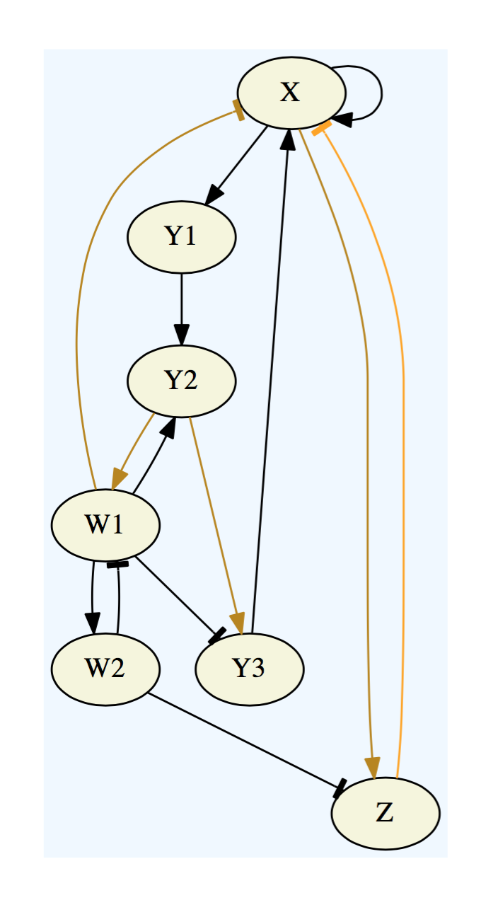

Networks
========

Network Spec Files
------------------

A *network specification file* is a text file which describes the interactions in a gene regulatory network. The specification file contains newline separated lines which describe each network node and the structure of its inputs. Each line is of the form ``X : L``, where ``X`` is the name of the network node (which we will call the *target of the line*, and ``L`` is an expression corresponding to the logic. Network node names may be any sequence of alphanumeric characters. In particular, spaces are not allowed. Logic expressions are sequences of node names joined together with whitespace, parentheses, ``+`` signs, and ``~`` signs. The whitespace and parentheses are optional and ignored except as separators. Nodes appearing in a logic  are called *source nodes of the line* and indicate a repressing edge when prefixed by ``~`` and an activating edge otherwise. Source nodes are partitioned into *factors*: Consecutively appearing source nodes in a logic expression belong to the same factor provided there is an intervening ``+`` symbol, and we extend this to non-consecutive source nodes via transitive closure.  The partitioning of source nodes into factors corresponds to the partition associated with the logic of the target node.

To the left we show a graphviz-rendering of a network specification file, where the activating edges are represented by normal arrowheads, the repressing edges are represented by blunt arrowheads, and the partitioning of input edges is represented by color coding. 

**Network Specification File**

::

  X : (X + Y3) ~Z ~W1
  Y1 : X
  Y2 : (Y1 + W1)
  Y3 : Y2(~W1)
  Z : X(~W2)
  W1 : Y2(~W2)
  W2 : W1

Network Builder
---------------

We provide a tool, `Network Builder`__, for graphically constructing networks and outputting network specification files. This tool also determines the number of parameters associated with a given network. The tool is browser based -- so in fact we can embed it in the documentation! Here it is:

__ https://shaunharker.github.io/DSGRN/software/NetworkBuilder/index.html

.. raw:: html
  
  <embed>
  <iframe 
    id="frame" 
    src="https://shaunharker.github.io/DSGRN/software/NetworkBuilder/index.html"
    width="100%"
    height="700" 
    scrolling="no">
  </iframe>
  </embed>
