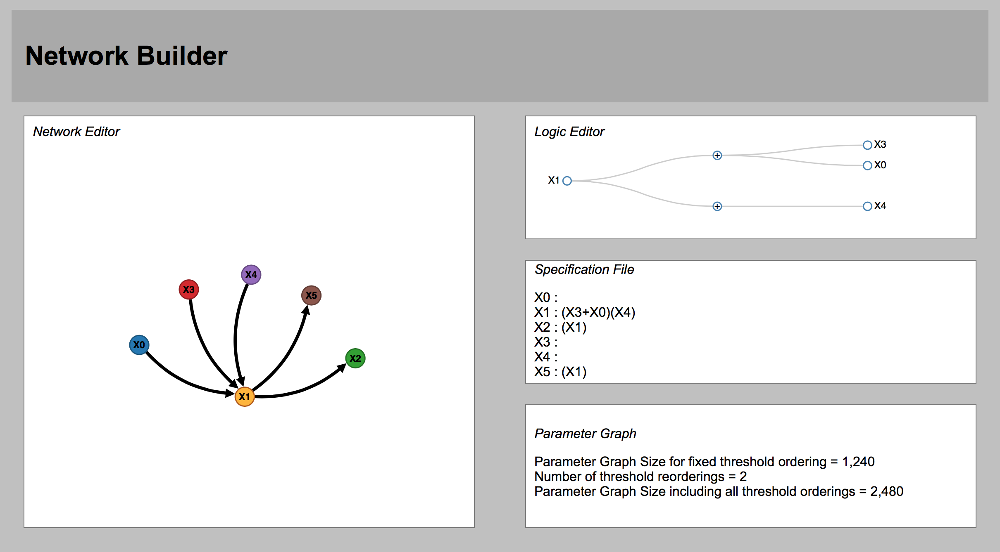

Parameters
==========

Network Nodes
-------------

A central principle to DSGRN is that there is a combinatorial representation of parameter space for a switching system model whch takes the form of a cartesian product of graphs associated with each node in the regulatory network. Thus, we regard a network node is a building block of a network. It consists of a vertex/variable, the number of input edges, the number of output edges, and a *logic*, which is an algebraic combination of variables associated with the input edges. In particular, we assume this algebraic combination is a product of sums, each input variable occurs precisely once, and all coefficients are one.

Logics and Partitions
---------------------

The logic :math:`L`, as a product of sums, can be associated with a partitioning of the inputs into :math:`k` groups of sizes :math:`p_1, p_2, p_3, \cdots, p_k`, where :math:`p_1 + p_2 + p_3 + ... + p_k = n` and without loss :math:`p_1 \leq p_2 \leq p_3 \leq \cdots \leq p_k`. We call :math:`(p_1, p_2, \cdots, p_k)` the *partition associated with the logic*. 

Description Files
-----------------

Given a network node, its *description triple* is the tuple :math:`(n,m,(p_1, p_2, \cdots, p_k))` where :math:`n` is the number of inputs, :math:`m` is the number of outputs, and :math:`(p_1, p_2, \cdots, p_k)` is the partition associated with the logic.

We maintain a repository of files which contain information about various network nodes. They are named in accordance to their description triple, using underscores as separators:

``n_m_p1_p2_p3_..._pk``

To clarify we give an example. Consider a network node named X1 with 3 inputs (X0, X3, and X4) and 2 outputs (X2 and X5), with a logic of :math:`(\mathrm{X3}+\mathrm{X0})\mathrm{X4}`. See the following figure:

Then we have :math:`n = 3`, :math:`m = 2`, and the logic :math:`L` is associated with a partition of :math:`n` into :math:`k=2` groups of sizes :math:`p_1 = 1` and :math:`p_2 = 2`. This results in the following name:

.. code-block:: bash

  3_2_1_2.txt

Parameter Representation
------------------------

A parameter can be understood as a set of inequalities between various input combinations and output thresholds for a network node. We give two conventions for representing parameters. The first is the *binning representation* and the second is the *hex representation*. The binning representation is more succinct, but we will prefer the hex representation because it lends itself to a more convenient comparison of parameters.

Binning Representation
++++++++++++++++++++++

The *binning representation* of a parameter arises by giving the *bin* for each of the :math:`2^n` input combinations. A bin is a number in :math:`\{0,1,\cdots,m\}` which determines the comparison between the input combination and the output edge. In particular a bin number of :math:`k` indicates that the input combination activates edges :math:`j` for :math:`j < k`. More precisely, a *binning representation* of parameter is the function

:math:`p: \{0,1\}^n \rightarrow \{0,1,\cdots,m\},`

where :math:`p(i) > j` iff the input combination :math:`i` activates edge :math:`j`.

Programmatically, :math:`p` may be encoded as an array of :math:`2^n` binning values. For example in our C++ implementation we store the binning representation as

.. code-block:: cpp

  std::vector<int64_t> bin_; 

.. NOTE::
  This is not as space efficient as possible. A more careful implementation would only require :math:`2^n \lceil \log_2 m \rceil` bits rather than :math:`64 \cdot 2^n`.

Hex Representation
++++++++++++++++++

In the *hex representation*, we explicitly record the status of each of the comparisons between the :math:`2^n` input combinations and the :math:`m` output thresholds. Generically, comparisons are either :math:`<` or :math:`>,` which we may represent respectively as the binary bits :math:`0` or :math:`1`. Accordingly, a *hex representation* encodes a :math:`2^n m` length sequence of bits as a hexadecimal code. The hex codes strings are presented in big-endian fashion, meaning that reading from left to right the most significant nybbles (4-bit characters) come first. 

We choose the following convention for the ordering of the bits. For :math:`0 \leq i < 2^n` and :math:`0 \leq j < m`, let :math:`b_{ij} = 1` if input i activates output j and let :math:`b_{ij} = 0` otherwise. We order the bits :math:`b_{ij}` so that the :math:`(mi + j)` th binary digit (where the 0th digit is the least significant) is :math:`b_{ij}`. 

To continue the above example (<<NetworkComponentExample>>), we list the contents of the network node description file for the :math:`(3,2,(1,2))` node:

.. code-block:: bash

  > cat 3_2_1_2.txt | tr '\n' ' '

::

  0000 4000 4040 4400 4440 4444 5000 5040 5050 5400 5440 5444 5450 5454 5500 5540 5544 5550 5554 5555 C000 C040 C0C0 C400 C440 C444 C4C0 C4C4 CC00 CC40 CC44 CCC0 CCC4 CCCC D000 D040 D050 D0C0 D0D0 D400 D440 D444 D450 D454 D4C0 D4C4 D4D0 D4D4 D500 D540 D544 D550 D554 D555 D5D0 D5D4 D5D5 DC00 DC40 DC44 DCC0 DCC4 DCCC DCD0 DCD4 DCDC DD00 DD40 DD44 DD50 DD54 DD55 DDC0 DDC4 DDCC DDD0 DDD4 DDD5 DDDC DDDD F000 F040 F050 F0C0 F0D0 F0F0 F400 F440 F450 F4C0 F4D0 F4D4 F4F0 F4F4 F500 F540 F550 F554 F555 F5D0 F5D4 F5D5 F5F0 F5F4 F5F5 FC00 FC40 FCC0 FCC4 FCCC FCD0 FCD4 FCDC FCF0 FCF4 FCFC FD00 FD40 FD44 FD50 FD54 FD55 FDC0 FDC4 FDCC FDD0 FDD4 FDD5 FDDC FDDD FDF0 FDF4 FDF5 FDFC FDFD FF00 FF40 FF44 FF50 FF54 FF55 FFC0 FFC4 FFCC FFD0 FFD4 FFD5 FFDC FFDD FFF0 FFF4 FFF5 FFFC FFFD FFFF

.. NOTE::
  The ``cat`` command reads the file and writes it to standard output, which is piped ``|`` to the ``tr '\n' ' '`` command, which replaces newlines with spaces. In the file itself the hex codes are separated by newlines.

We see that the network node description file contains the 155 hex codes which represent the network node parameters.

Comparison
++++++++++

As mentioned, the binning representation (if implemented carefully) has a space advantage over the hex representation. The hex representation has its own advantages:

* They can be encoded as a simple string
* Adjacent parameters differ by one bit in this representation
* They have meaning independent of the threshold ordering

Conversion
++++++++++

The following C++ code converts between the binning representation and the hex representation:

.. code-block:: cpp

  /// hex 
  ///   Return a hex code X which represents the parameter. The 
  ///   hex code represents a binary string in big-endian fashion. 
  ///   For 0 <= i < 2^n and 0 <= j < m, let b_{ij} be the
  ///   the (i*m + j)th binary digit of X (where the 0th digit is
  ///   the least significant).
  ///   Then b_{ij} = 1 if input i activates output j
  ///        b_{ij} = 0    otherwise
  std::string hex ( void ) const {
    std::string X;
    int64_t N = ( 1 << n );
    char nybble = 0, mask = 1;
    auto flush_nybble = [&] () { 
      // Hex digits 0-9
      if ( nybble < 10 ) X.push_back((char)(nybble + '0'));
      // Hex digits A-F
      else X.push_back((char)(nybble - 10 + 'A'));
      nybble = 0; mask = 1;
    };
    for ( int64_t i = 0; i < N; ++ i ) {
      for ( int64_t j = 0; j < m; ++ j ) {
        if ( bin_[i] > j ) nybble |= mask;
        mask <<= 1; if ( mask == 16 ) flush_nybble();
      }
    }
    if ( mask != 1 ) flush_nybble ();
    // Put into big-endian form.
    std::reverse( X . begin(), X . end () );
    return result;
  }

