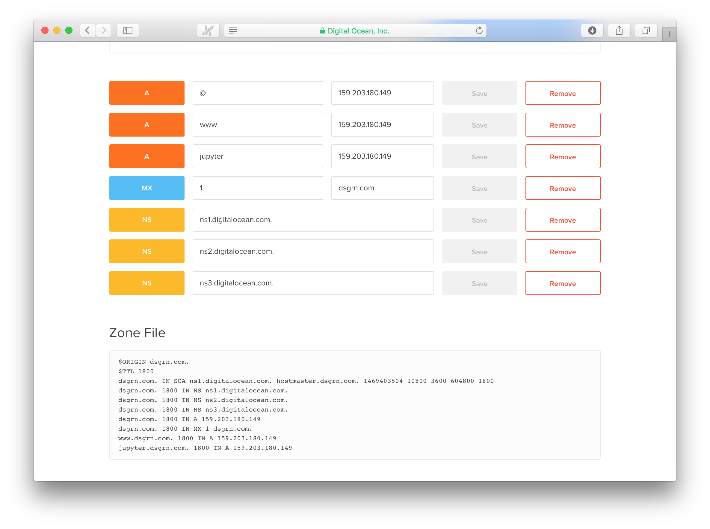

## How to deploy the DSGRN Server

Get root access from a fresh Ubuntu 16.04 installation.
(For example, spin up a droplet on Digital Ocean and name the droplet whatever you want the hostname to be. For instance, we used `dsgrn.com` )

```bash
cd ~
tar xvfz dsgrn_server.tar.gz
cd DSGRN_Server
cd DevOps
./install.sh host_name admin_username admin_password admin_email
```

For dsgrn.com, for instance, the hostname is dsgrn.com

For the web functionality to work, DNS records must be created. Here is an example:




## Self-signed certificates

It is possible to hit a rate limit on letsencrypt and get temporarily blocked for getting new certs. In this case a self-signed cert becomes necessary. Note to Mac users: currently Safari does not support websockets over SSL with self-signed certificates. Use Google Chrome instead.

To produce self-signed certificates:

    openssl req -x509 -nodes -newkey rsa:2048 -keyout key.pem -out cert.pem -days 120
    mkdir -p /etc/letsencrypt/live/dsgrn.com
    cp key.pem /etc/letsencrypt/live/dsgrn.com/privkey.pem
    cp cert.pem /etc/letsencrypt/live/dsgrn.com/cert.pem
    cp cert.pem /etc/letsencrypt/live/dsgrn.com/chain.pem

Note we put them in `letsencrypt`'s location to avoid having to change any configuration details.

Insert the following code in the `jupyter.dsgrn.com` vhost found in `/etc/apache2/sites-enables/securehosts.conf`:

    SSLProxyVerify none
    SSLProxyCheckPeerCN off
    SSLProxyCheckPeerName off

Then:

    service apache2 restart
